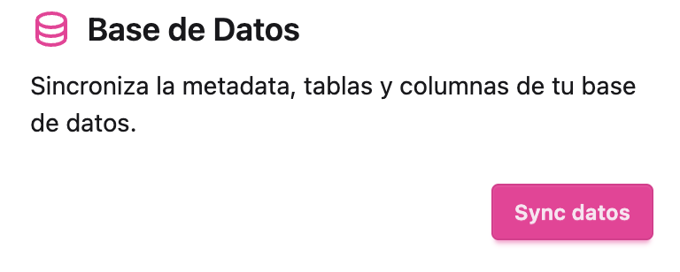

# Sistema de Reportes de SIESA

Todos los derechos reservados.


## Ejemplo de base de datos

```sql
docker compose exec -T db psql -U postgres < postgres/init_report_db.sql
```

## Configurar Ambiente de Producción

### Requerimientos

1. [Docker](https://docs.docker.com/engine/install/) o [Docker Desktop](https://docs.docker.com/desktop/)
2. [Docker compose](https://docs.docker.com/compose/install/)

### Pasos de instalación

1. Crear un folder llamando `siesa-reportes`.
2. Crear un archivo llamado `docker-compose.yaml` y agregar el contenido de [docker-compose.yaml](https://raw.githubusercontent.com/gams87/siesa-report/refs/heads/main/prod/docker-compose.yaml).
3. Crear un archivo llamado `.env` para los valores de nuestras credenciales y agregar el contenido de [.env.prod.example](https://raw.githubusercontent.com/gams87/siesa-report/refs/heads/main/prod/.env.prod.example).
4. Actualizar los valores del archivo `.env` de acuerdo a nuestro ambiente.
5. En una terminal ejecutar: `docker compose up -d`.
6. Cree un superusuario ejecutando el siguiente comando en una terminal: `docker compose exec core python manage.py createsuperuser`. (Guarde sus credenciales)
7. Abra el panel de administración, cree una compañia en [http://localhost/admin](http://localhost/admin) y establézcala como predeterminada.
8. Ya puede gestionar sus reportes en [http://localhost](http://localhost).
9. Puede sincronizar la base de datos en el siguiente componente del dahsboard:

